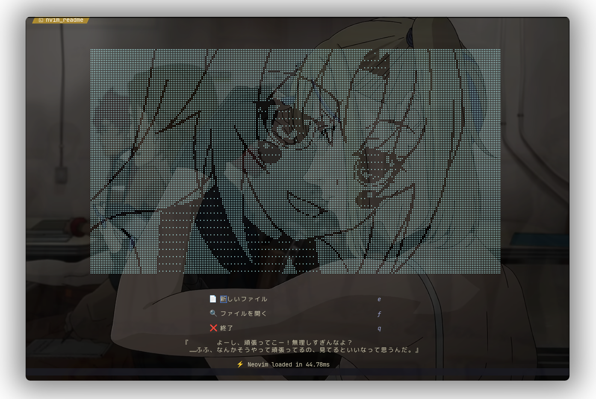
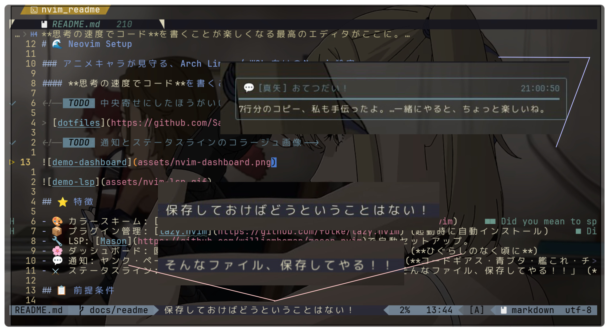
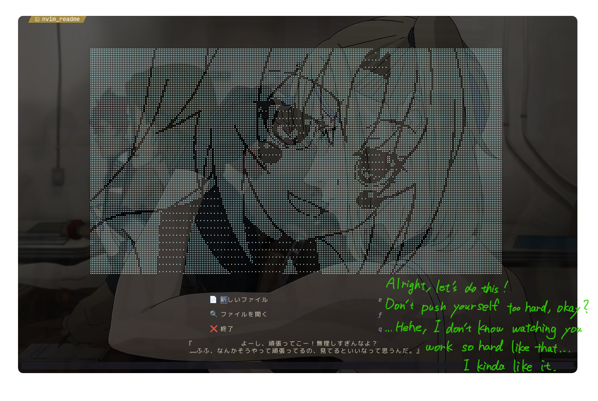
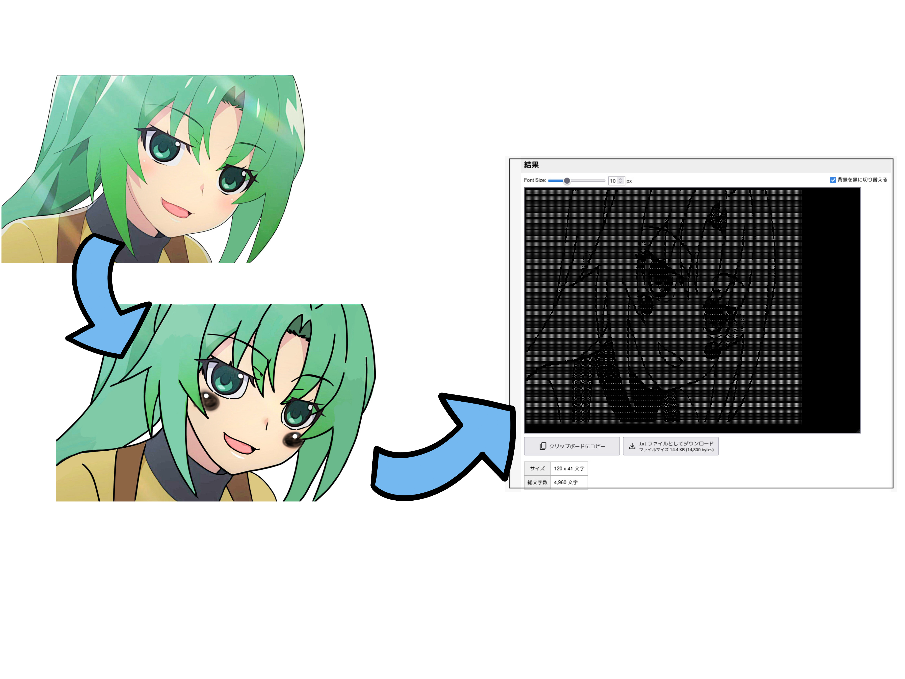
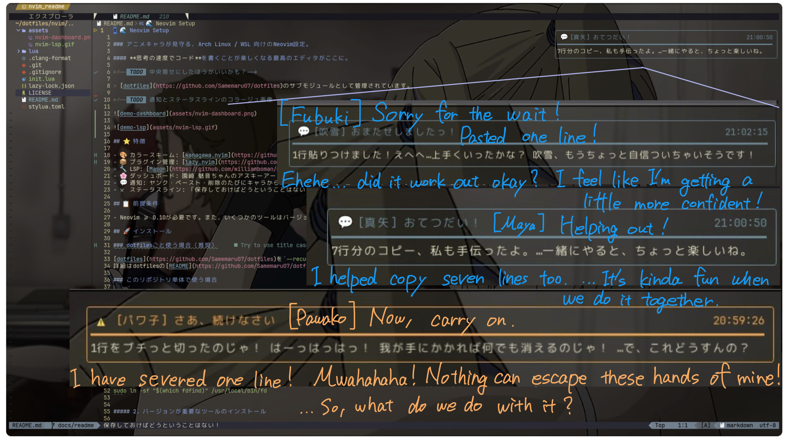
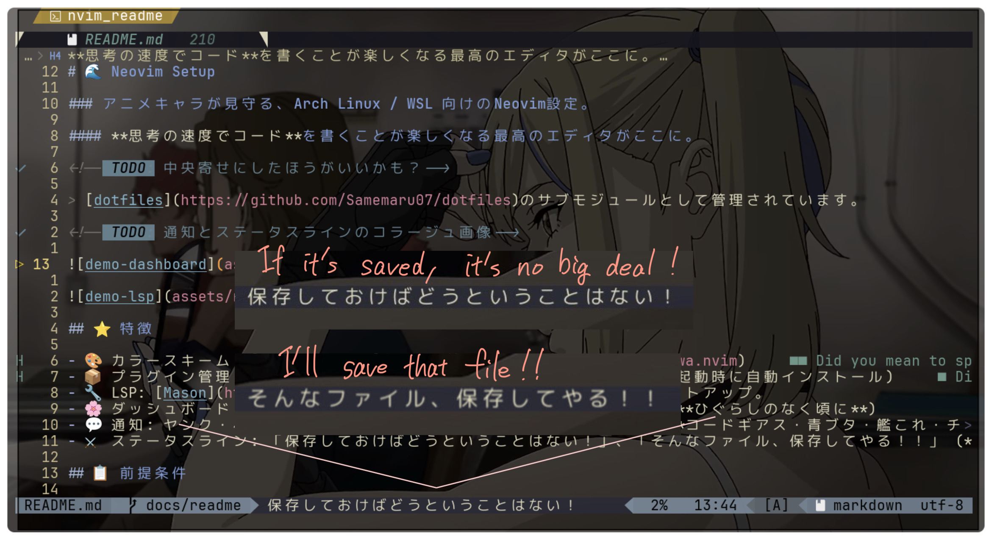

# 🌊 Neovim Setup

###### 🇯🇵 [日本語](./README.md) | 🇺🇸 English

<div align="center">
    <h3>A Neovim config for Arch Linux / WSL / macOS, watched over by anime characters.</h3>
</div>

<div align="center">
    <h5>The ultimate editor setup that makes coding at the speed of thought genuinely fun.</h5>
</div>

<div align="center">

[](https://neovim.io)
[](https://www.lua.org)
[](https://github.com/folke/lazy.nvim)
[](./LICENSE)

</div>

> [!NOTE]
> Managed as a submodule of [dotfiles](https://github.com/Samemaru07/dotfiles).

> [!NOTE]
> Screenshots may slightly differ from the current appearance.






## ⭐ Features

- 🎨 Color scheme: [kanagawa.nvim](https://github.com/rebelot/kanagawa.nvim)
- 📦 Plugin manager: [lazy.nvim](https://github.com/folke/lazy.nvim) (auto-installs on startup)
- 🔧 LSP: Auto-configured via [Mason](https://github.com/williamboman/mason.nvim)
- 🌸 Dashboard: Greeted by ASCII art and quotes from **Mion Sonozaki** (_Higurashi When They Cry_)
- 💬 Notifications: Anime characters send you messages on copy, paste, cut, and delete (_Code Geass, Fafner in the Azure, Rascal Does not Dream, Kantai Collection, Chainsaw Man_)
- ⚔️ Status line: _"If it's saved, it's no big deal!"_ and _"I'll save that file!!"_ (_Mobile Suit Gundam & Zeta Gundam_)

## 📋 Prerequisites

- **Windows native (`nvim.exe`) is currently not recommended.** Please use WSL instead.
- Neovim >= 0.10 is required. Some tools are version-sensitive - packages from `apt` may be outdated. Follow the [Installation section](#-installation) for details.

## 📁 Directory Structure

```
nvim/
    ├ init.lua              # Entry point
    ├ lazy-lock.json        # Plugin version lock file
    ├ tools/
    │   ├ .clang-format     # C/C++ formatter (clang-format) config
    │   └ stylua.toml       # Lua formatter (stylua) config
    ├ lua/
    │   ├ core/             # Options, keymaps, and autocommands
    │   ├ plugins/          # Plugin specs (lazy.nvim)
    │   ├ lsp/              # LSP config
    │   ├ cmp/              # Completion config
    │   ├ ui/               # UI plugins config
    │   ├ snippets/         # Snippets
    │   └ data/             # Data files (e.g. notify messages)
    └ assets/               # Images for README
```

## 🚀 Installation

### Use with dotfiles (Recommended)

Clone [dotfiles](https://github.com/Samemaru07/dotfiles) with `--recurse-submodules`.
See the dotfiles [README](https://github.com/Samemaru07/dotfiles) for details.

<details>
<summary>macOS</summary>

##### 1. Install Homebrew

If not already installed:

```bash
/bin/bash -c "$(curl -fsSL https://raw.githubusercontent.com/Homebrew/install/HEAD/install.sh)"
```

##### 2. Install required tools

```bash
brew install neovim git curl ripgrep fd node go rust shellcheck shfmt llvm
```

> **📍Note:** Installing `llvm` makes `clang-format` available.

##### 3. Python (usually pre-installed on macOS)

```bash
python3 --version
pip3 --version
```

If Python is not available:

```bash
brew install python3
```

##### 4. Optional: Install Deno

```bash
brew install deno
```

##### 5. Nerd Font (Recommended)

A Nerd Font is recommended for proper icon display.

```bash
brew tap homebrew/cask-fonts
brew install --cask font-hack-nerd-font
# or
brew install --cask font-jetbrains-mono-nerd-font
```

After installation, change the font in your terminal's settings.

##### 6. Set up SSH key authentication (GitHub)

```bash
ssh-keygen -t ed25519 -C "<your@mail>"
ssh-add ~/.ssh/id_ed25519
cat ~/.ssh/id_ed25519.pub
```

> **🔴 Important:** This config has the following entry in `.gitconfig` , which forces lazy.nvim to clone plugins over SSH.

```
    [url "git@github.com:"]
        insteadOf = https://github.com/
```

> **⚠️ Warning:** Therefore, SSH Agent must be running before you launch Neovim for the first time.
> On macOS, SSH Agent usually starts automatically, but you can start it manually with `eval "$(ssh-agent -s)"`.

- Register the printed public key on [GitHub](https://github.com/settings/keys).
- Verify:

```bash
    ssh -T git@github.com
```

##### 7. Clone

```bash
git clone https://github.com/Samemaru07/Neovim-setup.git ~/.config/nvim
```

##### 8. Launch Neovim

```bash
nvim
```

> **💡 Tip:** On first launch, lazy.nvim will automatically install all plugins.
> Mason will also set up LSP servers automatically.

</details>

<details>
<summary>WSL (Ubuntu)</summary>

##### 0. Pre-setup (Windows)

###### Place win32yank.exe

1. Download [win32yank](https://github.com/equalsraf/win32yank/releases).
2. Extract and place it in `C:\tools\`.

##### 1. Install basic tools

```bash
sudo apt update
sudo apt install -y git curl build-essential zsh ripgrep fd-find pulseaudio-utils xclip python3 python3-pip shellcheck shfmt clang-format wslu
sudo ln -sf "$(which fdfind)" /usr/local/bin/fd
```

##### 2. Install version-sensitive tools

###### Neovim

The `apt` version is outdated. Install from the official binary instead.

```bash
curl -LO https://github.com/neovim/neovim/releases/latest/download/nvim-linux-x86_64.tar.gz
sudo tar -C /opt -xzf nvim-linux-x86_64.tar.gz
sudo ln -sf /opt/nvim-linux-x86_64/bin/nvim /usr/local/bin/nvim
```

###### Node.js

The `apt` version is outdated. Install the LTS version via NodeSource instead.

```bash
curl -fsSL https://deb.nodesource.com/setup_lts.x | sudo -E bash -
sudo apt install nodejs -y
```

###### Go

The `apt` version is outdated. Install from the official tarball instead.

```bash
GO_VERSION=$(curl -fsSL "https://go.dev/VERSION?m=text" | head -1 | sed 's/^go//')
curl -LO "https://go.dev/dl/go${GO_VERSION}.linux-amd64.tar.gz"
sudo rm -rf /usr/local/go
sudo tar -C /usr/local -xzf "go${GO_VERSION}.linux-amd64.tar.gz"
export PATH="$PATH:/usr/local/go/bin"
```

###### Rust

```bash
curl --proto '=https' --tlsv1.2 -sSf https://sh.rustup.rs | sh -s -- -y
source "$HOME/.cargo/env"
```

###### Deno

```bash
curl -fsSL https://deno.land/install.sh | sh
```

##### 3. Set up SSH key authentication (GitHub)

```bash
ssh-keygen -t ed25519 -C "<your@mail>"
ssh-add ~/.ssh/id_ed25519
cat ~/.ssh/id_ed25519.pub
```

> **🔴 Important:** This config has the following entry in `.gitconfig`, which forces lazy.nvim to clone plugins over SSH.

```
    [url "git@github.com:"]
        insteadOf = https://github.com/
```

> **⚠️ Warning:** Therefore, SSH Agent must be running before you launch Neovim for the first time.
> Add SSH Agent auto-start to your `.zshrc`, or run `eval "$(ssh-agent -s)"` manually before adding your key.

- Register the printed public key on [GitHub](https://github.com/settings/keys).
- Verify:

```bash
    ssh -T git@github.com
```

##### 4. Clone

```bash
git clone https://github.com/Samemaru07/Neovim-setup.git ~/.config/nvim
```

##### 5. Launch Neovim

```bash
nvim
```

> **💡 Tip:** On first launch, lazy.nvim will automatically install all plugins.
> Mason will also set up LSP servers automatically.

</details>

<details>
<summary>Arch Linux</summary>

##### 1. Install basic tools

```bash
sudo pacman -Syu
sudo pacman -S --needed git curl zsh base-devel ripgrep fd xclip wl-clipboard python python-pip nodejs npm go rustup shellcheck shfmt clang
```

##### 2. Install Neovim

```bash
sudo pacman -S neovim
```

##### 3. Onwards

Follow the same steps as WSL, starting from step 3: Set up SSH key authentication (GitHub).

> **💡 Tip:** On first launch, lazy.nvim will automatically install all plugins.
> Mason will also set up LSP servers automatically.

</details>

## 🔌 Plugin List

<details>
<summary>UI</summary>

| Plugin                                                              | Description                   |
| ------------------------------------------------------------------- | ----------------------------- |
| [nvim-web-devicons](https://github.com/nvim-tree/nvim-web-devicons) | File icons                    |
| [neo-tree.nvim](https://github.com/nvim-neo-tree/neo-tree.nvim)     | File explorer                 |
| [bufferline.nvim](https://github.com/akinsho/bufferline.nvim)       | Buffer tab line               |
| [lualine.nvim](https://github.com/nvim-lualine/lualine.nvim)        | Status line                   |
| [toggleterm.nvim](https://github.com/akinsho/toggleterm.nvim)       | Terminal toggle               |
| [trouble.nvim](https://github.com/folke/trouble.nvim)               | Diagnostics & references list |
| [catppuccin](https://github.com/catppuccin/nvim)                    | Color scheme                  |
| [kanagawa.nvim](https://github.com/rebelot/kanagawa.nvim)           | Color scheme                  |
| [alpha-nvim](https://github.com/goolord/alpha-nvim)                 | Dashboard                     |
| [hlchunk.nvim](https://github.com/shellRaining/hlchunk.nvim)        | Indent highlight              |
| [noice.nvim](https://github.com/folke/noice.nvim)                   | UI enhancement                |
| [nui.nvim](https://github.com/MunifTanjim/nui.nvim)                 | UI component library          |
| [nvim-notify](https://github.com/rcarriga/nvim-notify)              | Notification system           |
| [which-key.nvim](https://github.com/folke/which-key.nvim)           | Keybinding hints              |
| [SmoothCursor.nvim](https://github.com/gen740/SmoothCursor.nvim)    | Cursor animation              |
| [todo-comments.nvim](https://github.com/folke/todo-comments.nvim)   | TODO comment highlight        |
| [neoscroll.nvim](https://github.com/karb94/neoscroll.nvim)          | Smooth scrolling              |
| [dropbar.nvim](https://github.com/Bekaboo/dropbar.nvim)             | Winbar navigation             |

</details>

<details>
<summary>LSP</summary>

| Plugin                                                                                    | Description                |
| ----------------------------------------------------------------------------------------- | -------------------------- |
| [nvim-lspconfig](https://github.com/neovim/nvim-lspconfig)                                | LSP configuration          |
| [mason.nvim](https://github.com/williamboman/mason.nvim)                                  | LSP / DAP / Linter manager |
| [mason-tool-installer.nvim](https://github.com/WhoIsSethDaniel/mason-tool-installer.nvim) | Auto-install Mason tools   |
| [mason-lspconfig.nvim](https://github.com/williamboman/mason-lspconfig.nvim)              | Mason-LSP bridge           |
| [lazydev.nvim](https://github.com/folke/lazydev.nvim)                                     | Lua LSP extension          |
| [luvit-meta](https://github.com/Bilal2453/luvit-meta)                                     | Lua type definitions       |
| [fidget.nvim](https://github.com/j-hui/fidget.nvim)                                       | LSP progress indicator     |

</details>

<details>
<summary>Completion</summary>

| Plugin                                                                              | Description                    |
| ----------------------------------------------------------------------------------- | ------------------------------ |
| [nvim-cmp](https://github.com/hrsh7th/nvim-cmp)                                     | Completion engine              |
| [cmp-nvim-lsp](https://github.com/hrsh7th/cmp-nvim-lsp)                             | LSP completion source          |
| [cmp-buffer](https://github.com/hrsh7th/cmp-buffer)                                 | Buffer completion source       |
| [cmp-path](https://github.com/hrsh7th/cmp-path)                                     | Path completion source         |
| [cmp-cmdline](https://github.com/hrsh7th/cmp-cmdline)                               | Command-line completion source |
| [cmp-skkeleton](https://github.com/uga-rosa/cmp-skkeleton)                          | SKK completion source          |
| [LuaSnip](https://github.com/L3MON4D3/LuaSnip)                                      | Snippet engine                 |
| [friendly-snippets](https://github.com/rafamadriz/friendly-snippets)                | Snippet collection             |
| [cmp_luasnip](https://github.com/saadparwaiz1/cmp_luasnip)                          | LuaSnip completion source      |
| [skkeleton](https://github.com/vim-skk/skkeleton)                                   | SKK Japanese input             |
| [denops.vim](https://github.com/vim-denops/denops.vim)                              | Deno runtime bridge            |
| [skkeleton_indicator.nvim](https://github.com/delphinus/skkeleton_indicator.nvim)   | SKK mode indicator             |
| [skkeleton-henkan-highlight](https://github.com/NI57721/skkeleton-henkan-highlight) | SKK conversion highlight       |

</details>

<details>
<summary>Editor</summary>

| Plugin                                                                                          | Description               |
| ----------------------------------------------------------------------------------------------- | ------------------------- |
| [nvim-treesitter](https://github.com/nvim-treesitter/nvim-treesitter)                           | Syntax parsing            |
| [nvim-treesitter-context](https://github.com/nvim-treesitter/nvim-treesitter-context)           | Context display           |
| [nvim-autopairs](https://github.com/windwp/nvim-autopairs)                                      | Auto bracket pairing      |
| [nvim-ts-autotag](https://github.com/windwp/nvim-ts-autotag)                                    | Auto HTML tag closing     |
| [Comment.nvim](https://github.com/numToStr/Comment.nvim)                                        | Comment toggle            |
| [nvim-ts-context-commentstring](https://github.com/JoosepAlviste/nvim-ts-context-commentstring) | Auto comment string       |
| [nvim-surround](https://github.com/kylechui/nvim-surround)                                      | Surround editing          |
| [flash.nvim](https://github.com/folke/flash.nvim)                                               | Fast navigation           |
| [emmet-vim](https://github.com/mattn/emmet-vim)                                                 | HTML / CSS expansion      |
| [beacon.nvim](https://github.com/rainbowhxch/beacon.nvim)                                       | Cursor position highlight |

</details>

<details>
<summary>Language</summary>

| Plugin                                                                           | Description             |
| -------------------------------------------------------------------------------- | ----------------------- |
| [vimtex](https://github.com/lervag/vimtex)                                       | LaTeX integration       |
| [flutter-tools.nvim](https://github.com/nvim-flutter/flutter-tools.nvim)         | Flutter support         |
| [verilog_systemverilog.vim](https://github.com/vhda/verilog_systemverilog.vim)   | Verilog / SystemVerilog |
| [vim-dadbod](https://github.com/tpope/vim-dadbod)                                | Database connection     |
| [vim-dadbod-ui](https://github.com/kristijanhusak/vim-dadbod-ui)                 | Database UI             |
| [vim-dadbod-completion](https://github.com/kristijanhusak/vim-dadbod-completion) | Database completion     |
| [markdown-preview.nvim](https://github.com/iamcco/markdown-preview.nvim)         | Markdown preview        |
| [bibcite.nvim](https://github.com/aidavdw/bibcite.nvim)                          | BibTeX management       |
| [vim-processing](https://github.com/sophacles/vim-processing)                    | Processing support      |

</details>

<details>
<summary>Tools</summary>

| Plugin                                                                                   | Description            |
| ---------------------------------------------------------------------------------------- | ---------------------- |
| [telescope.nvim](https://github.com/nvim-telescope/telescope.nvim)                       | Fuzzy finder           |
| [nvim-spectre](https://github.com/nvim-pack/nvim-spectre)                                | Search & replace UI    |
| [conform.nvim](https://github.com/stevearc/conform.nvim)                                 | Formatter manager      |
| [nvim-lint](https://github.com/mfussenegger/nvim-lint)                                   | Linter manager         |
| [gitsigns.nvim](https://github.com/lewis6991/gitsigns.nvim)                              | Git diff display       |
| [nvim-dap](https://github.com/mfussenegger/nvim-dap)                                     | Debugger               |
| [nvim-dap-ui](https://github.com/rcarriga/nvim-dap-ui)                                   | Debugger UI            |
| [nvim-nio](https://github.com/nvim-neotest/nvim-nio)                                     | Async I/O              |
| [nvim-dap-virtual-text](https://github.com/theHamsta/nvim-dap-virtual-text)              | Debug variable display |
| [mason-nvim-dap.nvim](https://github.com/jay-babu/mason-nvim-dap.nvim)                   | Mason-DAP bridge       |
| [neotest](https://github.com/nvim-neotest/neotest)                                       | Test runner            |
| [FixCursorHold.nvim](https://github.com/antoinemadec/FixCursorHold.nvim)                 | CursorHold fix         |
| [telescope-fzf-native.nvim](https://github.com/nvim-telescope/telescope-fzf-native.nvim) | Telescope speed boost  |
| [plenary.nvim](https://github.com/nvim-lua/plenary.nvim)                                 | Lua utility library    |
| [dressing.nvim](https://github.com/stevearc/dressing.nvim)                               | UI select enhancement  |

</details>

## 🛠️ Tool List

<details>
<summary>Formatters</summary>

| Tool                   | Language                         |
| ---------------------- | -------------------------------- |
| prettier               | HTML, JavaScript, JSON, Markdown |
| black                  | Python                           |
| clang_format           | C, C++, Processing               |
| pint                   | PHP                              |
| stylua                 | Lua                              |
| shfmt                  | Shell                            |
| pg_format              | SQL                              |
| latexindent            | LaTeX, BibTeX                    |
| verible-verilog-format | Verilog                          |
| goimports              | Go                               |
| qmlformat              | QML                              |
| markdownlint           | Markdown                         |

</details>

<details>
<summary>Linters</summary>

| Tool       | Language |
| ---------- | -------- |
| ruff       | Python   |
| ghdl       | VHDL     |
| shellcheck | Shell    |

</details>

<details>
<summary>LaTeX</summary>

| Tool          | Description               |
| ------------- | ------------------------- |
| latexmk       | LaTeX auto-build tool     |
| lualatex      | LaTeX engine              |
| neovim-remote | Remote control for vimtex |

</details>

<details>
<summary>SKK Dictionary</summary>

| Dictionary   | Description           |
| ------------ | --------------------- |
| SKK-JISYO.L  | SKK system dictionary |
| ~/.skkeleton | SKK user dictionary   |

</details>

<details>
<summary>Audio</summary>

| Tool   | Description                 |
| ------ | --------------------------- |
| paplay | Notification sound playback |

</details>

## ⌨️ Keymap List

- `<leader>` is the Space key.
- Mode abbreviations: `n` = Normal, `i` = Insert, `v` = Visual, `c` = Command, `t` = Terminal, `s` = Select, `o` = Operator-pending [^footnote]
  [^footnote]: `s` (Select) and `o` (Operator-pending) are modes primarily used internally by plugins. You don't need to think about them in day-to-day use.
- Operations that send to a Vim register are called "yank", while operations that send to the system clipboard are called "copy" or "cut".

<details>
<summary>Basic Operations</summary>

| Key                      | Mode          | Action                            |
| ------------------------ | ------------- | --------------------------------- |
| `<leader>h/j/k/l`        | n             | Move window (left/down/up/right)  |
| `<C-g>`                  | i, v, c, s, o | Escape                            |
| `<leader>s`              | n, v          | Format & save                     |
| `<leader>sq`             | n, v          | Format & save & close buffer      |
| `<leader>q`              | n             | Close buffer (without saving)     |
| `<C-S-s>`                | n, i          | Format & save & quit              |
| `<leader>c`              | v             | Copy                              |
| `<leader>v`              | n, v          | Paste                             |
| `<C-c>`                  | i             | Copy                              |
| `<C-v>`                  | i             | Paste                             |
| `<leader>a`              | n, v          | Select all                        |
| `<leader>d`              | n             | Delete line (black hole register) |
| `dd`                     | n             | Delete line (black hole register) |
| `<leader>x`              | n, v          | Cut line                          |
| `xx`                     | n             | Cut line                          |
| `d`                      | v             | Delete (black hole register)      |
| `x`                      | v             | Cut                               |
| `<C-h>`                  | i, n          | Delete word (backward)            |
| `<C-l>`                  | i, n          | Delete word (forward)             |
| `<A-Up/Down/Left/Right>` | n, i, v, t    | Resize window                     |
| `<leader><Up/Down>`      | n, v          | Move line                         |
| `<leader>cu/cd`          | n, v          | Duplicate line (up/down)          |
| `+/-`                    | n             | Increment / decrement number      |
| `<S-e>`                  | n, v          | Jump to matching bracket          |
| `zz / zt / zb`           | n             | Center / top / bottom cursor line |

</details>

<details>
<summary>LSP</summary>

| Key          | Mode | Action                                             |
| ------------ | ---- | -------------------------------------------------- |
| `K`          | n    | Show hover information                             |
| `gd`         | n    | Jump to definition                                 |
| `gr`         | n    | Show references                                    |
| `gi`         | n    | Jump to implementation                             |
| `<leader>rn` | n    | Rename symbol                                      |
| `<leader>ca` | n, v | Code action                                        |
| `[d`         | n    | Go to previous diagnostic                          |
| `]d`         | n    | Go to next diagnostic                              |
| `<leader>dl` | n    | Show diagnostic details                            |
| `<leader>m`  | n    | Toggle diagnostics list (Trouble)                  |
| `<leader>xx` | n    | Toggle workspace diagnostics list (Trouble)        |
| `<leader>xd` | n    | Toggle current-buffer diagnostics list (Trouble)   |

> [!NOTE]
> Because `trouble.nvim` is lazy-loaded, `<leader>m` becomes available only after loading Trouble via `<leader>xx` / `<leader>xd` (or `:Trouble`).

</details>

<details>
<summary>File & Search</summary>

| Key          | Mode | Action                         |
| ------------ | ---- | ------------------------------ |
| `<leader>f`  | n    | Search in current buffer       |
| `<leader>ff` | n    | Find file                      |
| `<leader>fb` | n    | List buffers                   |
| `<leader>fg` | n    | Search across all files (grep) |
| `<leader>fw` | n    | Search word under cursor       |
| `<leader>fs` | n    | Search document symbols        |
| `<leader>fS` | n    | Search workspace symbols       |
| `<leader>fc` | n    | Search & replace UI (Spectre)  |
| `<leader>e`  | n    | Toggle file tree               |

</details>

<details>
<summary>Buffer</summary>

| Key           | Mode | Action                            |
| ------------- | ---- | --------------------------------- |
| `<leader>1-9` | n    | Go to buffer 1–9                  |
| `<leader>.`   | n    | Go to next buffer                 |
| `<leader>,`   | n    | Go to previous buffer             |
| `<leader>bv`  | n, v | Vertical split (side by side)     |
| `<leader>bh`  | n, v | Horizontal split (top and bottom) |

</details>

<details>
<summary>Debug</summary>

| Key          | Mode | Action                 |
| ------------ | ---- | ---------------------- |
| `<leader>db` | n    | Toggle breakpoint      |
| `<leader>dc` | n    | Continue / start debug |

</details>

<details>
<summary>Terminal</summary>

| Key              | Mode | Action                       |
| ---------------- | ---- | ---------------------------- |
| `<C-h/j/k/l>`    | t    | Move to window from terminal |
| `<C-g>`          | t    | Exit terminal mode           |
| `<C-Right/Left>` | t    | Move by word (right/left)    |
| `<C-h>`          | t    | Backspace                    |
| `<C-l>`          | t    | Delete                       |

</details>

<details>
<summary>SKK (Japanese Input)</summary>

| Key     | Mode | Action                         |
| ------- | ---- | ------------------------------ |
| `<C-j>` | i, c | Toggle SKK                     |
| `<C-g>` | SKK  | Exit SKK                       |
| `q`     | SKK  | Convert to katakana            |
| `Q`     | SKK  | Convert to half-width katakana |

</details>

<details>
<summary>Breadcrumb Navigation (dropbar)</summary>

| Key         | Mode | Action                           |
| ----------- | ---- | -------------------------------- |
| `<leader>;` | n    | Pick symbol (winbar)             |
| `[;`        | n    | Jump to start of current context |
| `];`        | n    | Select next context              |

</details>

<details>
<summary>Misc</summary>

| Key          | Mode | Action                                   |
| ------------ | ---- | ---------------------------------------- |
| `<C-z>`      | i    | Search emojis via Telescope (emoji.nvim) |
| `<leader>g`  | n    | Open lazygit (floating)                  |
| `<leader>w`  | n    | Surround word (nvim-surround)            |
| `<leader>W`  | n    | Surround line (nvim-surround)            |
| `<leader>dq` | n    | Delete surrounding quotes                |
| `<leader>cq` | n    | Change quotes to brackets                |
| `<leader>z`  | n    | Highlight cursor position                |
| `<leader>rr` | n    | Reload Neovim config                     |

</details>

## ✨️ Highlights

### SKK Mode Indicator

Displays the current SKK input mode in the status line.


| Mode                | Display |
| ------------------- | ------- |
| ASCII input         | [A]     |
| Hiragana input      | [あ]    |
| Katakana input      | [ア]    |
| Half-width Katakana | [ｱ]     |

### Dashboard

Every time you launch Neovim, you're greeted by ASCII art and a quote from **Mion Sonozaki** (_Higurashi When They Cry_).

<div align="center"><h5>My first love.</h5></div>
<div align="center"><h5>私の初恋の娘です</h5></div>



> 『よーし、頑張ってこー！無理しすぎんなよ？......ふふ、なんかそうやって頑張ってるの、見てるといいなって思うんだ。』
> _Alright, let's do this! Don't push yourself too hard, okay? ...Hehe, I don't know - watching you work so hard like that... I kinda like it._

<div align="center"><h5>I would very much like her to be my bride.</h5></div>
<div align="center"><h5>ぜひお嫁さんになっていただきたい。</h5></div>

<details>
<summary>How to create the braille ASCII art</summary>

Created using [this tool](https://lazesoftware.com/en/tool/brailleaagen/).

1. Prepare the image you want to convert to braille ASCII art.
    - The rosy cheeks tend not to be recognized, so paint them with dark gray and add white highlights.
    - Fine shadows can look odd in ASCII art, so keep colors like hair color flat and consistent.
    - The background will also be converted as-is, so paint it white so Mion stands out.
2. Go to the link above, select `Image`, set the `Scaling` scale to around 30%, open `Detail settings`, check `Negative-positive inversion`, and click `Execute`.
    - Adjust the font size to match your actual font size. Setting a black background makes it easier to see. (You can also resize the `Result` text block.)
3. Click `Copy to clipboard` and paste the result into `dashboard_ascii` in `lua/ui/dashboard.lua`.
    - It's best to trim a bit from the top and bottom so the quote remains visible.



> Mion's image source: [here](https://x.com/5sVzDwTrW9kzYjs/status/1810690455992205717)

</details>

### Notification Messages

> [!NOTE]
> Yank is not configured to trigger notifications. Notifications are only sent for copy, paste, cut, and delete.

Anime characters send you random notifications based on your action.
Characters are from: _Code Geass_, _Fafner in the Azure_, _Rascal Does Not Dream_, _Kantai Collection_, and _Chainsaw Man_.
Note that the notification messages themselves are written in Japanese.

#### Favorite Messages



> [!NOTE]
> `%s` is a placeholder replaced with `n lines` - the number of lines affected by the operation.

| Action | Character                    | Message (EN)                                                                                                          | Message (JP)                                                                                                              |
| ------ | ---------------------------- | --------------------------------------------------------------------------------------------------------------------- | ------------------------------------------------------------------------------------------------------------------------- |
| Copy   | Maya (_Fafner in the Azure_) | Helping out!<br>I helped copy %s too. ...It's kinda fun when we do it together.                                       | おてつだい！<br>%s分のコピー、私も手伝ったよ。...一緒にやると、ちょっと楽しいね。                                         |
| Paste  | Fubuki (_Kantai Collection_) | Sorry for the wait!<br>Pasted %s! Ehehe... did it work out okay? I feel like I'm getting a little more confident!     | おまたせしましたっ！<br>%s貼りつけました！えへへ、...上手くいったかな？吹雪、もうちょっと自信ついちゃいそうです！         |
| Cut    | Power (_Chainsaw Man_)       | Now, carry on.<br>I have severed %s! Mwahahaha! Nothing can escape these hands of mine! ...So, what do we do with it? | さあ、続けなさい<br>%sをブチっと切ったのじゃ！はーっはっはっ！我が手にかかれば何でも消えるのじゃ！...で、これどうすんの？ |

<div align="center"><h5>So precious. Almost too precious.</h5></div>
<div align="center"><h5>尊い。尊すぎるよ。</h5></div>

### Status Line

A Gundam-inspired message is displayed in the status line based on the file's save state.



| State   | Character                           | Message                          |
| ------- | ----------------------------------- | -------------------------------- |
| Saved   | Char Aznable (_Mobile Suit Gundam_) | If it's saved, it's no big deal! |
| Unsaved | Kamille Bidan (_Zeta Gundam_)       | I'll save that file!!            |

> Original lines:\
> "If it doesn't hit, it's no big deal!" (Char Aznable / _Mobile Suit Gundam_, ep. 2 "Destroy Gundam")\
> 「当たらなければどうということはない！」(シャア・アズナブル / 機動戦士ガンダム 第2話 「ガンダム破壊命令」)\
> "I'll fix that adult!" (Kamille Bidan / _Zeta Gundam_, ep. 13 "Shuttle Launch")\
> 「そんな大人、修正してやる！」(カミーユ・ビダン / 機動戦士Zガンダム 第13話 「シャトル発進」)

<div align="center"><h5>It's a humble idea, but I'm very pleased with it.</h5></div>
<div align="center"><h5>私が思いついたのはこの程度ですが、非常に満足しています</h5></div>

<details>
<summary>How to change status messages</summary>

- To edit status messages, modify the `lualine_c` table in `lua/ui/lualine.lua`.

```lua
    lualine_c = {
            {
                function()
                    if vim.bo.buftype == "terminal" then
                        return ""
                    end
                    local ft = vim.bo.filetype
                    if ft == "neo-tree" then
                        return ""
                    end
                    if ft == "alpha" then
                        return ""
                    end

                    if vim.bo.modified then
                        return "<Message when not saved>"
                    else
                        return "<Message when saved>"
                    end
                end,
                color = nil,
            },
        },
```

</details>

## 📄 License

MIT License © 2026 Samemaru07

See [LICENSE](./LICENSE) for details.
